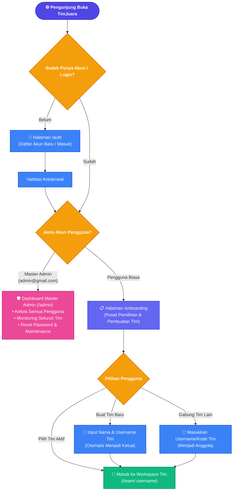
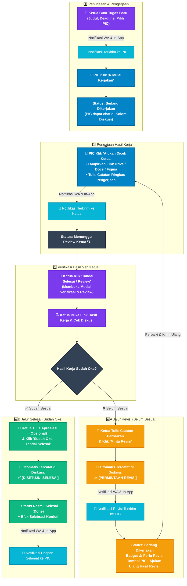
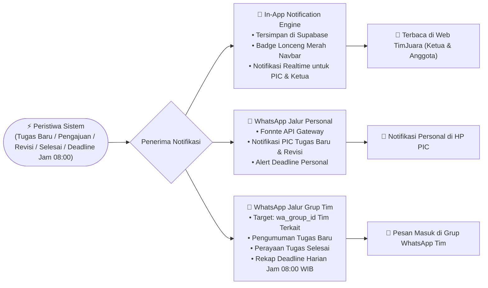
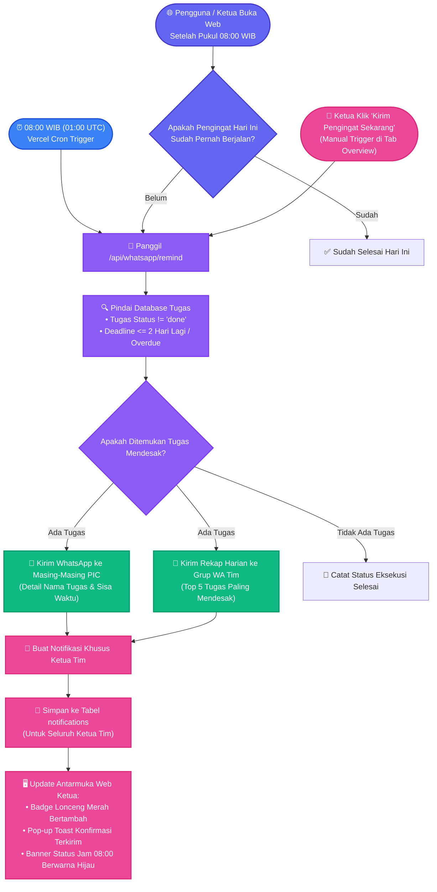
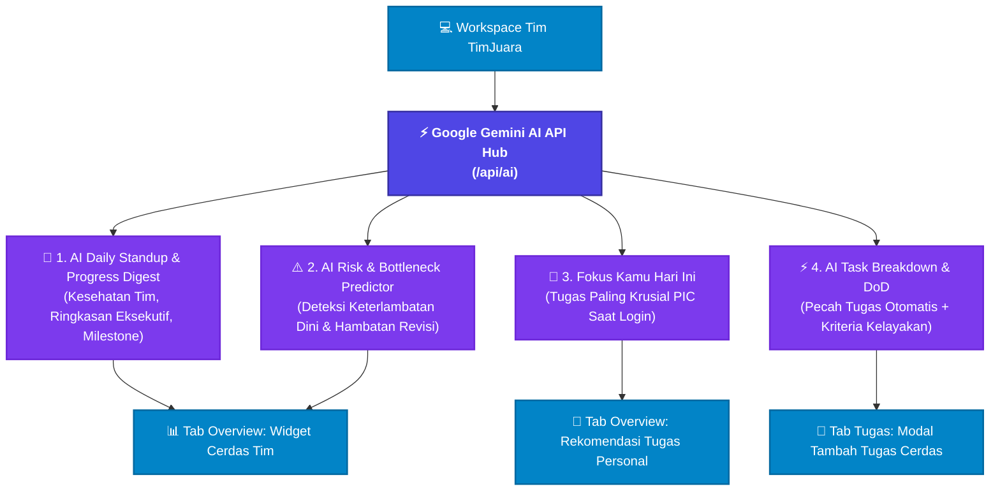

# 🧭 Alur Sistem & Flowchart TimJuara

Dokumentasi lengkap mengenai alur kerja, siklus hidup tugas, alur revisi, integrasi notifikasi WhatsApp, serta manajemen peran pada platform **TimJuara**.

---

## 1. Flowchart Alur Navigasi Pengguna (End-to-End System)

Diagram ini menggambarkan alur perjalanan pengguna mulai dari membuka platform, proses autentikasi, routing peran, hingga akses ke Workspace Tim atau Master Admin Dashboard.

---

## 2. Flowchart Siklus Hidup Tugas & Alur Revisi (Core Task Workflow)

Diagram ini mengilustrasikan alur kerja penugasan tugas dari awal pembuatan hingga selesai resmi, termasuk alur peninjauan (review) dan revisi oleh Ketua Tim.

---

## 3. Flowchart Integrasi Notifikasi Dual-Channel (In-App & WhatsApp)

Sistem memastikan setiap anggota tim selalu terbarui secara instan melalui dua jalur:

---

## 4. Flowchart Otomasi Pengingat Deadline Jam 08:00 WIB & Notifikasi Ketua Tim

Platform TimJuara memiliki mekanisme proteksi ganda (*Dual-Layer Engine*) untuk memastikan pengingat deadline selalu terkirim setiap pagi pukul 08:00 WIB:

---

## 5. Arsitektur 4 Fitur Cerdas Google Gemini AI

Platform dilengkapi kecerdasan buatan (*AI-Powered Workspace*) yang terhubung ke Google Gemini 2.0 / 1.5 Flash melalui `/api/ai` dengan *Smart Heuristic Fallback* (selalu berfungsi optimal meski tanpa API Key):

### Rincian 4 Fitur AI:
1. **🤖 AI Daily Standup & Progress Digest** *(Tab Overview)*:
   - Menganalisis seluruh riwayat pengerjaan, komentar diskusi, dan rasio penyelesaian tugas.
   - Memberikan badge kesehatan tim otomatis: `🟢 Sangat Sehat`, `🟡 Perlu Perhatian`, atau `🔴 Kritis`.
   - Menghasilkan ringkasan eksekutif instan untuk briefing pagi tim.
2. **⚠️ AI Risk & Bottleneck Predictor** *(Tab Overview)*:
   - Mendeteksi tugas yang berisiko terlambat (< 48 jam atau lewat deadline).
   - Menemukan tugas yang stagnan atau tertahan di status `Menunggu Review` / `Perlu Revisi`.
   - Memberikan rekomendasi tindakan preventif langsung kepada tim.
3. **🎯 Fokus Kamu Hari Ini** *(Personalized Next Action)*:
   - Terpersonalisasi otomatis berdasarkan akun anggota yang sedang login.
   - Mengarahkan perhatian anggota pada 1 tugas prioritas tertinggi (revisi mendesak > deadline hari ini > tugas aktif).
   - Tombol **"Kerjakan Sekarang ➔"** yang otomatis memindahkan fokus dan menyorot baris tugas terkait.
4. **⚡ AI Task Breakdown & Definition of Done** *(Modal Tambah Tugas)*:
   - **"✨ Pecah Tugas (AI)"**: Memecah judul tugas kompleks menjadi 3-4 subtask terstruktur beserta estimasi hari dan rekomendasi peran PIC (*Hacker / Developer*, *Hipster / Designer*, *Hustler / Writer*).
   - **"✨ Generate Kriteria DoD"**: Menghasilkan ceklis standar kelayakan (*Definition of Done*) otomatis di kolom deskripsi tugas.

---

## 6. Matriks Peran & Tanggung Jawab

| Komponen / Fitur | Anggota Tim (PIC) | Ketua Tim (Leader) | Master Admin |
| :--- | :---: | :---: | :---: |
| **Buat Tim Baru** | ✔️ *(otomatis jadi Ketua)* | ✔️ *(otomatis jadi Ketua)* | ✔️ |
| **Buat / Edit Tugas** | ❌ *(atau izin khusus)* | ✔️ | ✔️ |
| **Pecah Tugas Otomatis (AI Breakdown)** | ❌ | ✔️ | ✔️ |
| **Mulai Pengerjaan Tugas** | ✔️ *(tombol Mulai)* | ✔️ | ✔️ |
| **Ajukan Dicek Ketua** | ✔️ *(lampirkan link & catatan)* | ❌ *(Ketua langsung periksa)* | ❌ |
| **Minta Revisi Tugas** | ❌ | ✔️ *(wajib isi catatan revisi)* | ✔️ |
| **Tandai Selesai Resmi** | ❌ | ✔️ *(setelah verifikasi)* | ✔️ |
| **Diskusi / Komentar Tugas** | ✔️ | ✔️ | ✔️ |
| **Lihat Widget AI Overview & Fokus Personal** | ✔️ | ✔️ | ✔️ |
| **Trigger Pengingat Deadline Manual** | ❌ | ✔️ *(tombol di Overview)* | ✔️ |
| **Terima Notifikasi Otomasi Bot (Lonceng & Toast)** | ❌ | ✔️ | ✔️ |
| **Kelola Role Anggota** | ❌ | ✔️ *(ubah role / kick)* | ✔️ |
| **Konfigurasi WhatsApp Token & ID Grup** | ❌ | ✔️ | ✔️ |
| **Konfigurasi Google Gemini AI API Key** | ❌ | ❌ | ✔️ *(/admin)* |
| **Manajemen Pengguna Global** | ❌ | ❌ | ✔️ *(/admin)* |
| **Reset Password Pengguna** | ❌ | ❌ | ✔️ *(/admin)* |

---

## 7. Rincian Alur per Halaman

### 1. Halaman Autentikasi (`/auth`)
- Pengguna mendaftar dengan **Nama Lengkap**, **Nomor WhatsApp**, **Email**, dan **Password**.
- Nomor WhatsApp terhubung langsung ke sistem pemberitahuan pengerjaan dan pengingat deadline.
- Mendukung mode terang (Light Mode) dan mode gelap (Dark Mode).

### 2. Halaman Onboarding (`/onboarding`)
- Menampilkan seluruh tim yang dimiliki atau diikuti pengguna.
- Tombol **"Buat Tim Baru"** untuk mendirikan workspace lomba/proyek baru.
- Tombol **"Gabung Tim"** menggunakan tautan undangan atau memasukkan username tim unik.

### 3. Halaman Workspace Tim (`/team/[username]`)
- **Tab Overview**:
  * 4 Kartu Metrik Utama (Total Tugas, Dalam Proses, Menunggu Review, Selesai).
  * Banner Status Pengingat Deadline Jam 08:00 WIB + Tombol Manual Trigger untuk Ketua.
  * Kartu Cerdas **AI Daily Standup Digest & Risk Predictor**.
  * Kartu Interaktif **🎯 Fokus Kamu Hari Ini**.
- **Tab Papan Tugas**:
  * Daftar tugas dengan urutan prioritas dinamis (tugas selesai otomatis berada di posisi paling bawah).
  * Filter status (`Semua`, `Belum Dimulai`, `Sedang Dikerjakan`, `Menunggu Review`, `Selesai`).
  * Modal Tambah Tugas lengkap dengan fitur **✨ Pecah Tugas (AI)** dan **✨ Generate Kriteria DoD**.
- **Modal Verifikasi & Review**:
  * Sarana Ketua untuk memeriksa hasil kerja pengerja sebelum menyelesaikan tugas dengan opsi **Minta Revisi** atau **Tandai Selesai**.
- **Kolom Diskusi Tugas**: Riwayat chat antar anggota per tugas dengan counter komentar real-time.
- **Bahan Riset**: Tempat menyimpan referensi dokumen, link Google Drive, Figma, atau spreadsheet tim.
- **Leaderboard**: Statistik jumlah kontribusi tugas yang telah diselesaikan masing-masing anggota.
- **Pengaturan Tim**: Mengelola anggota tim, token gateway WhatsApp (Fonnte), dan pemilihan ID Grup WhatsApp tim.

### 4. Dashboard Master Admin (`/admin`)
- Akses eksklusif untuk akun `admin@gmail.com`.
- **Manajemen Pengguna**: Perbarui nama, nomor WA, email, reset password, atau hapus akun pengguna.
- **Pemantauan Tim & ID Grup WhatsApp**: Monitoring seluruh tim yang terdaftar dan opsi konfigurasi ID Grup WhatsApp per tim secara terpusat.
- **Konfigurasi Google Gemini AI**: Form input API Key Gemini, instruksi langkah-demi-langkah mendapatkan API Key gratis di Google AI Studio, dan fitur **"Tes Koneksi AI"**.

