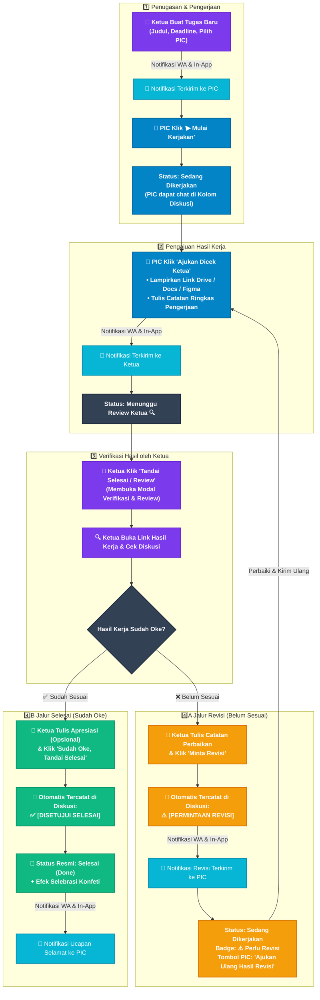
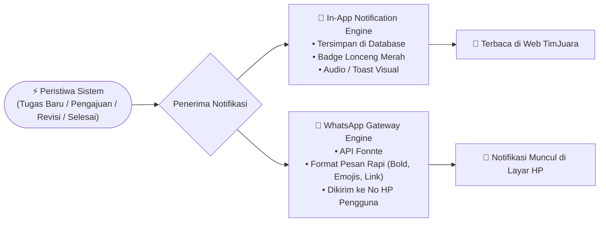

# 🧭 Alur Sistem & Flowchart TimJuara

Dokumentasi lengkap mengenai alur kerja, siklus hidup tugas, alur revisi, integrasi notifikasi WhatsApp, serta manajemen peran pada platform **TimJuara**.

---

## 1. Flowchart Alur Navigasi Pengguna (End-to-End System)

Diagram ini menggambarkan alur perjalanan pengguna mulai dari membuka platform, proses autentikasi, routing peran, hingga akses ke Workspace Tim atau Master Admin Dashboard.

---

## 2. Flowchart Siklus Hidup Tugas & Alur Revisi (Core Task Workflow)

Diagram ini mengilustrasikan alur kerja penugasan tugas dari awal pembuatan hingga selesai resmi, termasuk alur peninjauan (review) dan revisi oleh Ketua Tim.

---

## 3. Flowchart Integrasi Notifikasi Dual-Channel (In-App & WhatsApp)

Sistem memastikan setiap anggota tim selalu terbarui secara instan melalui dua jalur:

---

## 4. Matriks Peran & Tanggung Jawab

| Komponen / Fitur | Anggota Tim (PIC) | Ketua Tim (Leader) | Master Admin |
| :--- | :---: | :---: | :---: |
| **Buat Tim Baru** | ✔️ *(otomatis jadi Ketua)* | ✔️ *(otomatis jadi Ketua)* | ✔️ |
| **Buat / Edit Tugas** | ❌ *(atau izin khusus)* | ✔️ | ✔️ |
| **Mulai Pengerjaan Tugas** | ✔️ *(tombol Mulai)* | ✔️ | ✔️ |
| **Ajukan Dicek Ketua** | ✔️ *(lampirkan link & catatan)* | ❌ *(Ketua langsung periksa)* | ❌ |
| **Minta Revisi Tugas** | ❌ | ✔️ *(wajib isi catatan revisi)* | ✔️ |
| **Tandai Selesai Resmi** | ❌ | ✔️ *(setelah verifikasi)* | ✔️ |
| **Diskusi / Komentar Tugas** | ✔️ | ✔️ | ✔️ |
| **Kelola Role Anggota** | ❌ | ✔️ *(ubah role / kick)* | ✔️ |
| **Konfigurasi WhatsApp Token** | ❌ | ✔️ | ✔️ |
| **Manajemen Pengguna Global** | ❌ | ❌ | ✔️ *(/admin)* |
| **Reset Password Pengguna** | ❌ | ❌ | ✔️ *(/admin)* |

---

## 5. Rincian Alur per Halaman

### 1. Halaman Autentikasi (`/auth`)
- Pengguna mendaftar dengan **Nama Lengkap**, **Nomor WhatsApp**, **Email**, dan **Password**.
- Nomor WhatsApp terhubung langsung ke sistem pemberitahuan pengerjaan dan pengingat deadline.
- Mendukung mode terang (Light Mode) dan mode gelap (Dark Mode).

### 2. Halaman Onboarding (`/onboarding`)
- Menampilkan seluruh tim yang dimiliki atau diikuti pengguna.
- Tombol **"Buat Tim Baru"** untuk mendirikan workspace lomba/proyek baru.
- Tombol **"Gabung Tim"** menggunakan tautan undangan atau memasukkan username tim unik.

### 3. Halaman Workspace Tim (`/team/[username]`)
- **Papan Tugas**: Daftar tugas dengan filter status (`Semua`, `Belum Dimulai`, `Sedang Dikerjakan`, `Menunggu Review`, `Selesai`).
- **Modal Verifikasi & Review**: Sarana Ketua untuk memeriksa hasil kerja pengerja sebelum menyelesaikan tugas.
- **Kolom Diskusi Tugas**: Riwayat chat antar anggota per tugas dengan counter komentar real-time.
- **Bahan Riset**: Tempat menyimpan referensi dokumen, link Google Drive, Figma, atau spreadsheet tim.
- **Leaderboard**: Statistik jumlah kontribusi tugas yang telah diselesaikan masing-masing anggota.
- **Pengaturan Tim**: Mengelola anggota dan token gateway WhatsApp (Fonnte).

### 4. Dashboard Master Admin (`/admin`)
- Akses eksklusif untuk akun `admin@gmail.com`.
- Manajemen penuh seluruh pengguna: perbarui nama, nomor WA, email, reset password, atau hapus akun.
- Pemantauan keaktifan tim dan total tugas yang dikerjakan.
