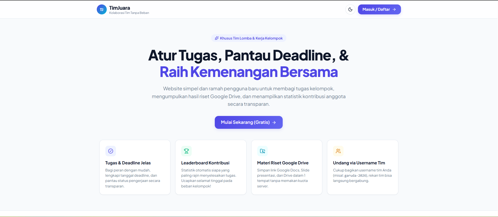
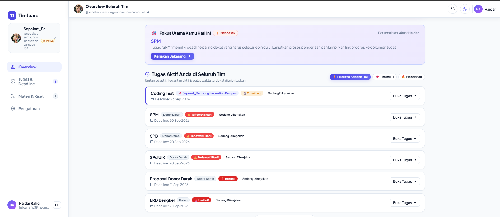
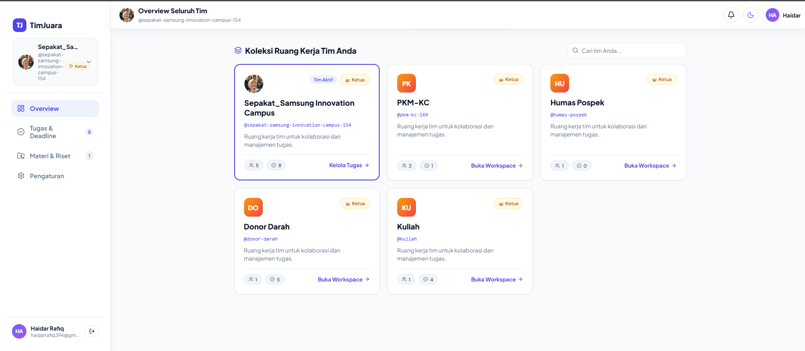
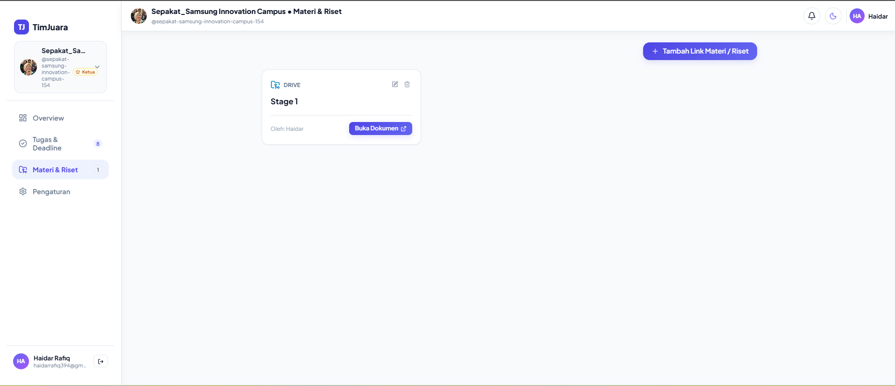
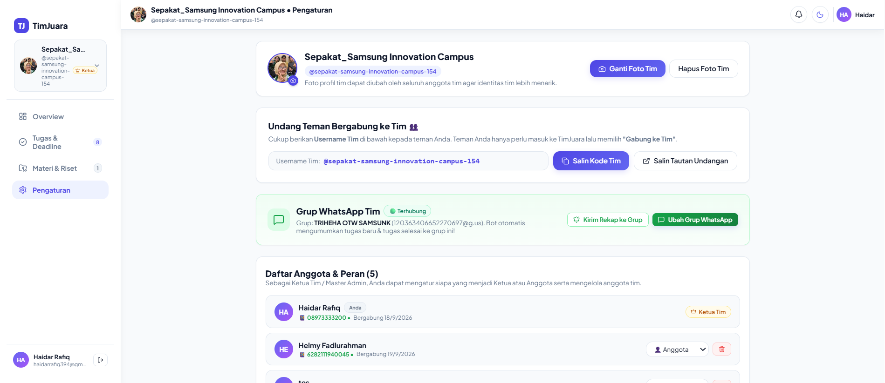

# 🏆 TimJuara
### Platform Kolaborasi Tim Lomba & Manajemen Kerja Kelompok Terpadu

  <b>Solusi modern untuk mahasiswa, pelajar, dan tim kompetisi/hackathon agar dapat berkolaborasi secara rapi, transparan, dan bebas dari drama "beban kelompok".</b>

### 🚀 [**Buka Website TimJuara Sekarang (Gratis): timjuara.vercel.app**](https://timjuara.vercel.app)

 

---

## 📌 Latar Belakang & Masalah yang Diselesaikan

Dalam kerja kelompok kuliah maupun persiapan kompetisi (PKM, Hackathon, Business Plan, Riset), seringkali muncul kendala klasik:
- ❌ **Deadline Terlewat**: Anggota lupa tenggat waktu pengumpulan tugas.
- ❌ **Tautan Tercecer**: File Google Drive, Docs, Figma, atau formulir pengumpulan hilang di tumpukan chat grup.
- ❌ **Ketidakjelasan Kontribusi (*Free Rider*)**: Sulit memantau siapa yang benar-benar aktif bekerja dan siapa yang pasif.
- ❌ **Alur Revisi Tidak Rapi**: Tidak ada catatan resmi mengenai apa yang perlu diperbaiki sebelum tugas diserahkan.

**TimJuara hadir sebagai platform terintegrasi** yang memadukan manajemen tugas interaktif, alur verifikasi resmi oleh ketua, repositori materi terpusat, analitik kecerdasan buatan (AI), serta notifikasi otomatis WhatsApp ke seluruh anggota dan grup tim.

---

## 📸 Galeri Fitur & Antarmuka Aplikasi

### 1. 📊 Overview Seluruh Tim & Ringkasan Harian AI
> Dasbor utama akun yang merangkum seluruh tim yang diikuti, metrik tugas aktif, dan evaluasi cerdas harian bertenaga AI untuk memprediksi hambatan tim.

---

### 2. 🎯 Fokus Personal Hari Ini & Pelacak Deadline Adaptif
> Rekomendasi tugas terpenting yang dipersonalisasi untuk akun Anda hari ini, dilengkapi pelacak batas waktu dengan label prioritas visual (*Terlewat*, *Hari Ini*, *2 Hari Lagi*).

---

### 3. 📋 Manajemen Tugas Tim & Alur Kerja Kolaboratif
> Ruang kerja tim untuk membagi tugas, menetapkan penanggung jawab (PIC), menyematkan tautan hasil kerja, memantau kemajuan tim, dan mengirim rekap ke grup WhatsApp dalam satu klik.

---

### 4. 🗂️ Koleksi Ruang Kerja Multi-Tim
> Kelola berbagai tim lomba, proyek kuliah, atau kepanitiaan sekaligus dalam satu akun tanpa perlu keluar-masuk akun berbeda.

---

### 5. 📁 Repositori Materi & Riset Terpadu
> Satukan seluruh berkas Google Drive, referensi literatur, panduan lomba, dan desain Figma tim Anda dalam satu tab khusus yang rapi dan hemat kuota.

---

### 6. ⚙️ Pengaturan Tim & Integrasi Grup WhatsApp
> Atur foto tim, undang anggota dengan kode unik `@username-tim`, dan hubungkan grup WhatsApp agar bot otomatis mengumumkan penugasan dan kelulusan tugas.

---

### 7. 📱 Tampilan Responsif di Smartphone (Mobile)
> Antarmuka adaptif yang responsif dan nyaman digunakan langsung dari layar handphone kapan pun dan di mana pun.

  

---

## ✨ Fitur-Fitur Unggulan

### 🤖 1. Asisten Cerdas TimJuara AI
- **Ringkasan Harian & Prediksi Risiko**: Menganalisis kondisi seluruh tim yang Anda ikuti secara holistik, menyajikan tingkat kelengkapan, progres terkini, dan rekomendasi aksi praktis setiap hari.
- **Deteksi Hambatan Dini (*Bottleneck Detector*)**: Mendeteksi otomatis tugas-tugas kritis yang mendekati batas waktu atau membutuhkan atensi segera.
- **Fokus Utama Kamu Hari Ini**: Rekomendasi personal yang memprioritaskan 1 tugas paling mendesak bagi anggota yang sedang login.
- **Pemecah Tugas Otomatis (*AI Task Breakdown*)**: Membantu memecah tugas besar menjadi 3–5 subtugas terstruktur beserta estimasi target waktu dan saran penanggung jawab hanya dalam hitungan detik.

### 📲 2. Otomasi Bot WhatsApp Terintegrasi
- **Pengingat Deadline Harian**: Bot otomatis memindai dan mengirimkan pengingat deadline ke nomor WhatsApp pribadi anggota dan grup WhatsApp tim setiap pagi jam **08:00 WIB**.
- **Notifikasi Persetujuan Tugas**: Ketika Ketua Tim menyetujui tugas yang diselesaikan anggota, pengumuman otomatis langsung dikirimkan ke grup WhatsApp tim.
- **Kirim Rekapitulasi Cepat**: Bagikan rekap tugas dan batas waktu tim ke grup WhatsApp hanya dengan satu kali klik.

### 🔍 3. Alur Verifikasi & Review Ketua Tim
- **Pengajuan Berkas Kerja**: Anggota dapat menyematkan tautan langsung ke Google Docs, Google Drive, Slide, atau Figma saat mengajukan tugas.
- **Hak Verifikasi Ketua**: Ketua Tim dapat memeriksa hasil kerja sebelum menyetujui tugas (*disertai efek selebrasi confetti*) atau memberikan catatan revisi jika ada bagian yang perlu disempurnakan.

### 🏆 4. Leaderboard Kontribusi Transparan
- Sistem penilaian otomatis yang menghitung persentase kontribusi kerja dari setiap anggota tim.
- Menumbuhkan rasa tanggung jawab bersama dan memberikan apresiasi yang adil bagi anggota yang paling berdedikasi.

### 📁 5. Repositori Materi & Riset Terpadu
- Mengorganisir tautan riset, literatur, dokumen panduan lomba, slide presentasi, dan folder drive dalam satu tab khusus yang rapi.
- Bebas kuota server karena memanfaatkan integrasi tautan langsung (*cloud drive*).

### 👥 6. Akses Multi-Tim dalam Satu Akun
- Pengguna dapat membuat atau bergabung ke banyak tim sekaligus tanpa perlu membuat akun baru.
- Bergabung ke tim rekan sangat mudah hanya dengan memasukkan kode unik `@username-tim`.

---

## 🛠️ Arsitektur & Teknologi

Platform ini dibangun menggunakan fondasi teknologi modern untuk performa tinggi, keamanan optimal, dan pengalaman pengguna yang halus:

| Komponen | Teknologi | Deskripsi |
| :--- | :--- | :--- |
| **Frontend Framework** | [Next.js 16](https://nextjs.org/) | App Router, React 19, Turbopack |
| **Bahasa Pemrograman** | [TypeScript](https://www.typescriptlang.org/) | Tipe data ketat untuk keandalan kode |
| **Styling & Desain** | Modern Vanilla CSS | Desain responsif, Glassmorphism, Micro-animations |
| **Backend & Database** | [Supabase](https://supabase.com/) | PostgreSQL dengan Row Level Security (RLS) |
| **Kecerdasan Buatan (AI)**| [Google Gemini](https://ai.google.dev/) | Model LLM cerdas untuk analisis progres & standup |
| **Gateway WhatsApp** | REST API Service | Pengiriman notifikasi otomatis realtime & terjadwal |
| **Hosting & Deployment** | [Vercel](https://vercel.com/) | CI/CD otomatis dengan performa Edge Network |

---

## 🚀 Cara Mudah Memulai (Langsung Akses di Web)

Tidak perlu instalasi apa pun di komputer Anda. Anda bisa langsung mencoba platform ini dalam hitungan detik:

1. 🌐 **Buka Website**: Kunjungi [**timjuara.vercel.app**](https://timjuara.vercel.app).
2. 📝 **Buat Akun Gratis**: Masukkan nama lengkap, nomor WhatsApp (agar bot bisa mengingatkan deadline Anda), email, dan kata sandi.
3. 👥 **Buat atau Gabung Tim**:
   - Klik **"Buat Tim Baru"** jika Anda ingin menjadi ketua dan membuat ruang kerja untuk tim lomba/kelompok Anda.
   - Atau klik **"Gabung Tim"** lalu masukkan kode unik `@username-tim` yang dibagikan oleh rekan Anda.
4. 🚀 **Mulai Berkolaborasi**: Bagikan tugas, set deadline, sematkan link dokumen hasil kerja, dan nikmati kolaborasi tim yang bebas dari drama!

 

### [👉 **Klik di Sini untuk Mulai Menggunakan TimJuara Secara Gratis**](https://timjuara.vercel.app)

 

---

Dikembangkan dengan dedikasi untuk mendukung kolaborasi dan prestasi tim di Indonesia. 🇮🇩

