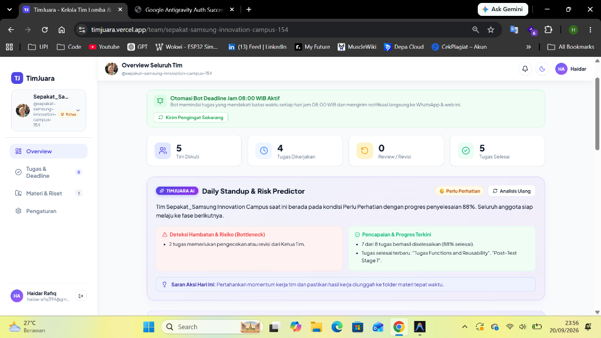
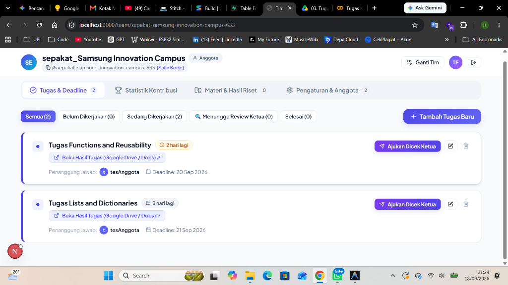
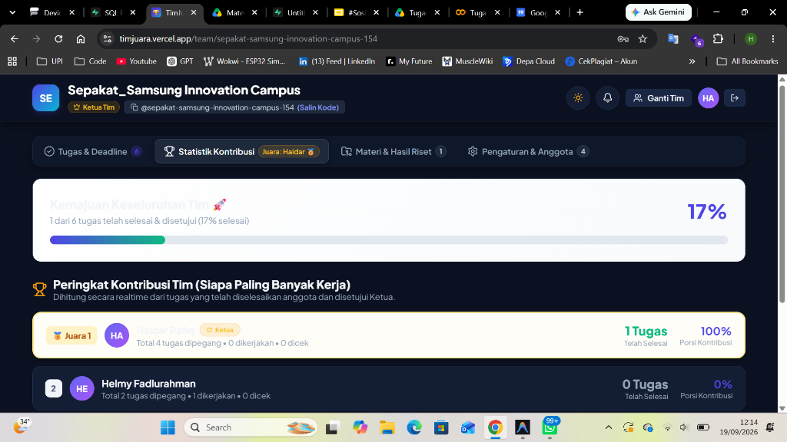
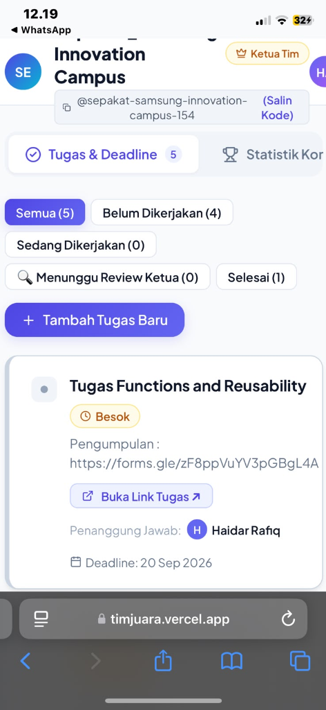

<div align="center">

# 🏆 TimJuara
### Platform Kolaborasi Tim Lomba & Manajemen Kerja Kelompok Terpadu

[](https://timjuara.vercel.app)
[](https://nextjs.org/)
[](https://www.typescriptlang.org/)
[](https://supabase.com/)
[](LICENSE)

<p align="center">
  <b>Solusi modern untuk mahasiswa, pelajar, dan tim kompetisi/hackathon agar dapat berkolaborasi secara rapi, transparan, dan bebas dari drama "beban kelompok".</b>
</p>

[🌐 **Kunjungi Website Live: timjuara.vercel.app**](https://timjuara.vercel.app)

</div>

---

## 📌 Latar Belakang & Masalah yang Diselesaikan

Dalam kerja kelompok kuliah maupun persiapan kompetisi (PKM, Hackathon, Business Plan, Riset), seringkali muncul kendala klasik:
- ❌ **Deadline Terlewat**: Anggota lupa tenggat waktu pengumpulan tugas.
- ❌ **Tautan Tercecer**: File Google Drive, Docs, Figma, atau form pengumpulan hilang di tumpukan chat grup.
- ❌ **Ketidakjelasan Kontribusi (*Free Rider*)**: Sulit memantau siapa yang benar-benar aktif bekerja dan siapa yang pasif.
- ❌ **Alur Revisi Tidak Rapi**: Tidak ada catatan resmi mengenai apa yang perlu diperbaiki sebelum tugas diserahkan.

**TimJuara hadir sebagai platform terintegrasi** yang memadukan manajemen tugas interaktif, alur verifikasi resmi oleh ketua, repositori materi terpusat, analitik kecerdasan buatan (AI), serta notifikasi otomatis WhatsApp ke seluruh anggota dan grup tim.

---

## 📸 Tampilan Antarmuka (Screenshots)

### 1. 📊 Overview Seluruh Tim & Ringkasan Harian AI
> Dasbor utama akun yang merangkum seluruh tim yang diikuti, metrik tugas aktif, dan evaluasi cerdas harian bertenaga AI.



---

### 2. 📋 Manajemen Tugas & Alur Kerja Kolaboratif
> Ruang kerja tim untuk membagi tugas, menetapkan penanggung jawab (PIC), menyematkan tautan hasil kerja, dan memantau status pengerjaan.



---

### 3. 🏆 Papan Peringkat Kontribusi (Leaderboard) & Mode Gelap
> Statistik transparan dan objektif yang menghitung kontribusi nyata setiap anggota, dilengkapi dukungan tema gelap (*Dark Mode*) yang elegan.



---

### 4. 📱 Tampilan Responsif di Perangkat Mobile
> Desain adaptif yang nyaman digunakan langsung dari smartphone anggota tim kapan pun dan di mana pun.

<div align="center">
  
</div>

---

## ✨ Fitur-Fitur Unggulan

### 🤖 1. Asisten Cerdas TimJuara AI
- **Ringkasan Harian & Prediksi Risiko**: Menganalisis kondisi seluruh tim yang Anda ikuti secara holistik, menyajikan tingkat kelengkapan, progres terkini, dan rekomendasi aksi praktis setiap hari.
- **Deteksi Hambatan Dini (*Bottleneck Detector*)**: Secara otomatis mendeteksi tugas-tugas kritis yang mendekati batas waktu atau membutuhkan atensi segera.
- **Fokus Utama Kamu Hari Ini**: Rekomendasi personal yang memprioritaskan 1 tugas paling mendesak bagi anggota yang sedang login.
- **Pemecah Tugas Otomatis (*AI Task Breakdown*)**: Membantu memecah tugas besar menjadi 3–5 subtugas terstruktur beserta estimasi target waktu dan saran penanggung jawab hanya dalam hitungan detik.

### 📲 2. Otomasi Bot WhatsApp Terintegrasi
- **Pengingat Deadline Harian**: Bot otomatis memindai dan mengirimkan pengingat deadline ke nomor WhatsApp pribadi anggota dan grup WhatsApp tim setiap pagi.
- **Notifikasi Persetujuan Tugas**: Ketika Ketua Tim menyetujui tugas yang diselesaikan anggota, pengumuman otomatis langsung dikirimkan ke grup WhatsApp tim.
- **Kirim Rekapitulasi Cepat**: Bagikan rekap tugas dan batas waktu tim ke grup WhatsApp hanya dengan satu kali klik.

### 🔍 3. Alur Verifikasi & ACC Ketua Tim
- **Pengajuan Berkas Kerja**: Anggota dapat menyematkan tautan langsung ke Google Docs, Google Drive, Slide, atau Figma pengerjaan mereka saat mengajukan tugas.
- **Hak Verifikasi Ketua**: Ketua Tim dapat memverifikasi kualitas pekerjaan sebelum menyetujui tugas (*disertai efek selebrasi confetti*) atau memberikan catatan revisi jika ada bagian yang perlu disempurnakan.

### 🏆 4. Leaderboard Kontribusi Transparan
- Sistem penilaian otomatis yang menghitung persentase kontribusi kerja dari setiap anggota tim.
- Menumbuhkan rasa tanggung jawab bersama dan memberikan apresiasi yang adil bagi anggota yang paling berdedikasi.

### 📁 5. Repositori Materi & Riset Terpadu
- Mengorganisir tautan riset, literatur, dokumen panduan lomba, slide presentasi, dan folder drive dalam satu tab khusus yang rapi.
- Hemat kuota dan ringan karena memanfaatkan integrasi tautan langsung (*cloud drive*).

### 👥 6. Dukungan Multi-Tim dalam Satu Akun
- Pengguna dapat membuat atau bergabung ke banyak tim sekaligus tanpa perlu membuat akun baru.
- Bergabung ke tim rekan sangat mudah hanya dengan memasukkan kode unik `@username-tim`.

---

## 🛠️ Arsitektur & Teknologi

Platform ini dibangun menggunakan fondasi teknologi modern untuk performa tinggi, keamanan optimal, dan pengalaman pengguna yang halus:

| Komponen | Teknologi | Deskripsi |
| :--- | :--- | :--- |
| **Frontend Framework** | [Next.js 16](https://nextjs.org/) | App Router, React 19, Turbopack |
| **Bahasa Pemrograman** | [TypeScript](https://www.typescriptlang.org/) | Tipe data ketat untuk keandalan kode |
| **Styling & Desain** | Modern Vanilla CSS | Desain responsif, Glassmorphism, Micro-animations |
| **Backend & Database** | [Supabase](https://supabase.com/) | PostgreSQL dengan Row Level Security (RLS) |
| **Kecerdasan Buatan (AI)**| [Google Gemini](https://ai.google.dev/) | Model LLM cerdas untuk analisis progres & standup |
| **Gateway WhatsApp** | REST API Service | Pengiriman notifikasi otomatis realtime & terjadwal |
| **Hosting & Deployment** | [Vercel](https://vercel.com/) | CI/CD otomatis dengan performa Edge Network |

---

## 🚀 Panduan Memulai (Menjalankan Secara Lokal)

Jika Anda ingin menjalankan atau mengembangkan proyek ini di lingkungan lokal:

### 1. Kloning Repositori
```bash
git clone https://github.com/haidar394/TimJuara.git
cd TimJuara
```

### 2. Instalasi Dependensi
```bash
npm install
```

### 3. Konfigurasi Lingkungan (Opsional)
Salin file template konfigurasi lingkungan:
```bash
cp .env.example .env.local
```
Tambahkan variabel lingkungan Supabase dan API pendukung Anda di `.env.local`:
```env
NEXT_PUBLIC_SUPABASE_URL=https://your-project.supabase.co
NEXT_PUBLIC_SUPABASE_ANON_KEY=your-anon-key
```

> **Catatan**: Jika file `.env.local` tidak diisi, TimJuara memiliki mode demo cerdas lokal sehingga antarmuka tetap dapat diuji secara mandiri.

### 4. Jalankan Server Pengembangan
```bash
npm run dev
```
Buka peramban Anda di [http://localhost:3000](http://localhost:3000) untuk melihat aplikasi berjalan.

### 5. Build untuk Produksi
```bash
npm run build
npm run start
```

---

## 📄 Lisensi
Didistribusikan di bawah lisensi MIT. Lihat file `LICENSE` untuk informasi lebih lanjut.

---

<div align="center">
  <sub>Dikembangkan dengan dedikasi untuk mendukung kolaborasi dan prestasi tim di Indonesia. 🚀</sub><br>
  <b><a href="https://timjuara.vercel.app">Mulai Kelola Tim Anda di TimJuara →</a></b>
</div>
